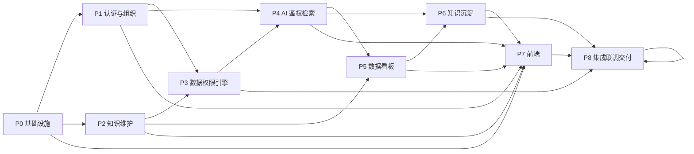

# 知识库管理平台（KBMS）实施任务分解

| 项目 | 内容 |
| --- | --- |
| 文档名称 | 实施任务分解（WBS） |
| 版本 | v1.0 |
| 关联文档 | [PRD](./知识库管理平台PRD.md)、[SPEC](./知识库管理平台SPEC.md)、[开发规范](./开发规范.md) |
| 工作量单位 | 人日（1 人全职 1 天，复杂度中等；仅作排期参考，非承诺工期） |
| 状态 | 待评审 |

> 优先级：P0 关键路径 / P1 高 / P2 中 / P3 低。
> 交付定义（DoD）：任务完成须满足「可独立验收」——有可运行产物 + 对应测试通过 + 无阻断下游的 TODO。

---

## 1. 阶段总览与依赖关系

### 1.1 阶段划分

| 阶段 | 名称 | 目标 | 关键产出 | 优先级 |
| --- | --- | --- | --- | --- |
| P0 | 基础设施与脚手架 | 搭建可运行骨架与数据底座 | 工程脚手架、DB 模型与迁移、统一框架 | P0 |
| P1 | 认证与组织架构 | 完成登录与 RBAC 基础 | JWT 鉴权、用户/角色/部门 CRUD | P0 |
| P2 | 知识维护 | 打通导入与知识单元管理 | RAG 客户端、导入、单元 CRUD | P0 |
| P3 | 数据权限引擎 | 实现四维数据权限判定 | check-permissions、权限配置接口 | P0 |
| P4 | AI 鉴权检索 | 打通鉴权问答链路 | chat/stream SSE、会话管理 | P0 |
| P5 | 数据看板 | 量化运营指标 | 访问日志、指标/榜单/趋势接口 | P1 |
| P6 | 知识沉淀 | FAQ 闭环与缺口 | FAQ 挖掘/审核/缓存、知识缺口 | P1 |
| P7 | 前端（React+AntD） | 交付全部页面 | 登录/组织/知识/对话/看板/沉淀 | P1 |
| P8 | 集成联调与交付 | 端到端验收 | 演示链路、接口文档、交付物 | P0 |

### 1.2 阶段依赖图



### 1.3 关键路径

```
P0（脚手架+DB） → P1（认证组织） → P3（权限引擎） → P4（AI 问答） → P6（沉淀） → P8（联调交付）
```

- 前端（P7）与后端 P1–P6 **并行推进**，以「接口 mock / 契约已定（SPEC §4）」为联调锚点；P7.4 / P7.5 / P7.6 / P7.7 需在对应后端接口就绪后联调。
- P5（看板）依赖 P4 产生 `qa_access_logs`，故排在 P4 之后；P6（沉淀）依赖 P5 的日志与向量接口。

---

## 2. 任务清单

### 阶段 0：基础设施与脚手架

| ID | 任务 | 目标 | 关键交付 / 验收 | 依赖 | 优先级 | 工作量(人日) |
| --- | --- | --- | --- | --- | --- | --- |
| T0.1 | 后端脚手架初始化 | 建立 `admin/` FastAPI 工程骨架 | `pyproject.toml`、`main.py`、分层目录（models/schemas/api/services/repositories/core），`uvicorn admin.main:app` 可启动 | — | P0 | 1 |
| T0.2 | 前端脚手架初始化 | 建立 React+AntD 工程 | Vite+TS 可 `pnpm build`，路由/axios/zustand 就位 | — | P0 | 1 |
| T0.3 | PostgreSQL 数据模型与迁移 | 建全 10 张表 | SQLAlchemy 模型 + Alembic 迁移（含索引/唯一约束），`alembic upgrade head` 通过 | T0.1 | P0 | 2 |
| T0.4 | 种子数据脚本 | 预置超管/角色/权限码/示例部门 | `scripts/init_seed.py` 幂等可重复执行 | T0.3 | P0 | 0.5 |
| T0.5 | 统一框架约定 | 统一响应/异常/分页/日志 | `code/message/data` 响应、全局异常处理、loguru 集成 | T0.1 | P0 | 1 |

> 衔接逻辑：T0 收口后，后端各服务与前端均以此骨架和 DB 底座展开；T0.5 的响应/异常约定是全项目接口一致的先决条件。

### 阶段 1：认证与组织架构

| ID | 任务 | 目标 | 关键交付 / 验收 | 依赖 | 优先级 | 工作量(人日) |
| --- | --- | --- | --- | --- | --- | --- |
| T1.1 | 认证鉴权模块 | 登录/刷新/登出/当前用户 | JWT 签发校验、bcrypt 比对、`/auth/login/refresh/logout/me`；登录返回 token+permissions | T0.3,T0.5 | P0 | 2 |
| T1.2 | RBAC 中间件 | 菜单/按钮级操作权限拦截 | 依赖注入鉴权 + `role_permissions` 校验，403 拦截 | T1.1 | P0 | 1 |
| T1.3 | 部门管理 | 部门树 CRUD | `/api/org/departments` 增删改查，删除含子/成员时拒绝 | T0.3 | P0 | 1 |
| T1.4 | 用户管理 | 用户 CRUD/密码/状态 | `/api/org/users` 全量接口，密码重置、启停用 | T1.1,T1.3 | P0 | 1.5 |
| T1.5 | 角色与权限分配 | 角色 CRUD + 权限树分配 | `/api/org/roles`、`/roles/{id}/permissions` 全量覆盖 | T1.2 | P0 | 1.5 |

> 衔接逻辑：T1 是数据权限引擎（P3）与前端登录/权限渲染（P7.2）的共同前置。

### 阶段 2：知识维护

| ID | 任务 | 目标 | 关键交付 / 验收 | 依赖 | 优先级 | 工作量(人日) |
| --- | --- | --- | --- | --- | --- | --- |
| T2.1 | RAG HTTP 客户端 | 封装外部集成 | `rag_client`：upload/recall/embed/query/stream/task/history 统一封装、超时/重试 | T0.1 | P0 | 1.5 |
| T2.2 | 知识导入 | 单/批量上传 + 进度 + 元数据落库 | `/api/knowledge/import` 转发 RAG、轮询任务、写 `knowledge_units`（锚点 `source_file_name` 幂等） | T2.1,T0.3 | P0 | 2 |
| T2.3 | 知识单元 CRUD | 列表/详情/编辑/批量删除 | `/api/knowledge/units` 分页查询、详情、更新、`DELETE` 批量同步删向量 | T2.1 | P0 | 1.5 |
| T2.4 | 知识单元权限配置接口 | 写/查数据权限实体 | `/units/{id}/permissions` 全量覆盖，落 `unit_permissions` | T2.3 | P0 | 1 |

> 衔接逻辑：T2 产出知识单元元数据与锚点，是 P3 权限引擎判定对象的输入。

### 阶段 3：数据权限引擎

| ID | 任务 | 目标 | 关键交付 / 验收 | 依赖 | 优先级 | 工作量(人日) |
| --- | --- | --- | --- | --- | --- | --- |
| T3.1 | 数据权限引擎 | 四维实体 OR 判定 | `permission_engine`：用户停用即拒绝→global/department(含祖先)/role/user 任一命中即放行 | T1.4,T1.5 | P0 | 2 |
| T3.2 | check-permissions 接口 | 对外鉴权判定 | `/api/knowledge/check-permissions` 返回 `authorized/unauthorized_unit_ids` | T3.1 | P0 | 0.5 |

> 衔接逻辑：P3 是 AI 鉴权问答（P4）的核心前置，也供 RAG recall 后过滤。

### 阶段 4：AI 鉴权检索

| ID | 任务 | 目标 | 关键交付 / 验收 | 依赖 | 优先级 | 工作量(人日) |
| --- | --- | --- | --- | --- | --- | --- |
| T4.1 | 鉴权问答流式接口 | 登录态+数据权限+SSE | `/api/ai/chat/stream`：recall→鉴权→白名单 query→SSE(delta/sources/unauthorized/result) | T2.1,T3.2 | P0 | 3 |
| T4.2 | 会话管理 | 会话列表/历史/清空 | `/api/ai/sessions`、`/sessions/{id}/messages`（转发 RAG history） | T4.1 | P0 | 1 |

> 衔接逻辑：T4 是 P5 看板日志的写入源头，也是沉淀（P6）FAQ/Gap 的数据来源。

### 阶段 5：数据看板

| ID | 任务 | 目标 | 关键交付 / 验收 | 依赖 | 优先级 | 工作量(人日) |
| --- | --- | --- | --- | --- | --- | --- |
| T5.1 | 访问日志异步写入 | 记录每轮问答事实 | `qa_access_logs` 异步写（用户/耗时/Token/命中/未授权） | T4.1 | P1 | 1 |
| T5.2 | 指标/榜单/趋势接口 | 聚合运营指标 | metrics、rankings/questions、rankings/units、stats/tokens、stats/access | T5.1 | P1 | 2 |

> 衔接逻辑：T5 产出沉淀（P6）聚合所需的事实表与向量复用入口。

### 阶段 6：知识沉淀

| ID | 任务 | 目标 | 关键交付 / 验收 | 依赖 | 优先级 | 工作量(人日) |
| --- | --- | --- | --- | --- | --- | --- |
| T6.1 | FAQ 自动挖掘 | 高频问题推荐 | 定时任务：embed 语义去重+频次聚合→`faqs(status=pending_review)` | T5.1,T2.1 | P1 | 2 |
| T6.2 | FAQ 审核与缓存 | 审核发布 + 命中缓存 | review 接口、`published` 落库、命中直接返回答（PostgreSQL 承载） | T6.1 | P1 | 2 |
| T6.3 | 知识缺口 | 未命中问题聚合与补全 | 缺口生成/列表/resolve/ignore | T5.1,T2.1 | P1 | 1.5 |

> 衔接逻辑：T6 是平台的"闭环"价值点，依赖 P4/P5 数据，向前端沉淀页（P7.7）提供接口。

### 阶段 7：前端（React + Ant Design）

| ID | 任务 | 目标 | 关键交付 / 验收 | 依赖 | 优先级 | 工作量(人日) |
| --- | --- | --- | --- | --- | --- | --- |
| T7.1 | 登录与认证层 | Token 管理与登录页 | axios interceptor 注入 JWT、zustand 存 user/token、登录跳转 | T0.2 | P1 | 1.5 |
| T7.2 | 布局与动态菜单 | RBAC 菜单/按钮控制 | 路由守卫、按 `permissions` 渲染菜单、按钮级权限指令 | T7.1 | P1 | 1.5 |
| T7.3 | 组织架构页面 | 用户/角色/部门管理页 | 部门树、用户列表/编辑、角色权限树 | T1.3,T1.4,T1.5 | P1 | 2 |
| T7.4 | 知识维护页面 | 导入 + 单元管理页 | 拖拽上传/进度轮询/单元列表/编辑 + 权限选择弹窗 | T2.2,T2.3,T2.4 | P1 | 2.5 |
| T7.5 | AI 对话工作台 | 鉴权问答页 | 多轮对话、SSE 流式、Markdown 渲染、引用/缺失卡片 | T4.1,T4.2 | P1 | 2.5 |
| T7.6 | 数据看板页 | 指标与图表 | 指标卡、榜单、趋势图（图表库） | T5.2 | P1 | 2 |
| T7.7 | 知识沉淀页 | FAQ 审核 + 缺口 | 推荐列表/审核操作、缺口列表/一键建档 | T6.2,T6.3 | P1 | 1.5 |

> 衔接逻辑：前端以「先本地 mock → 后端接口就绪后切换真实接口」推进，减少对后端进度的硬阻塞。

### 阶段 8：集成联调与交付

| ID | 任务 | 目标 | 关键交付 / 验收 | 依赖 | 优先级 | 工作量(人日) |
| --- | --- | --- | --- | --- | --- | --- |
| T8.1 | 端到端联调 | 全链路打通 | 导入→配权→鉴权问答→看板→沉淀 演示链路可在 compose 一键跑通 | T3–T7 全部 | P0 | 2 |
| T8.2 | 文档与验收 | 补齐交付物 | 接口说明（OpenAPI）、示例知识文档、验收标准逐项核对 | T8.1 | P0 | 1 |

---

## 3. 里程碑

| 里程碑 | 达成条件 | 涉及任务 |
| --- | --- | --- |
| M1 底座就绪 | compose 一键启动，DB 迁移 + 种子通过，登录可跑通 | T0, T1.1 |
| M2 权限闭环 | 四维数据权限判定正确，check-permissions 可用 | T1, T2, T3 |
| M3 问答闭环 | 鉴权问答 SSE 全链路可用，含缺失提示 | T4 |
| M4 价值闭环 | 看板 + 沉淀（FAQ/Gap）可用 | T5, T6 |
| M5 可交付 | 前端全页面 + 端到端演示链路通过验收 | T7, T8 |

---

## 4. 执行建议

1. **后端主线先于前端硬依赖**：P1→P3→P4 优先打通（价值最高、风险最集中），前端 P7 并行推进并用 mock 缓冲。
2. **T3（权限引擎）务必单测覆盖**：四维 OR 判定是安全核心，边界（停用用户、祖先部门、混合实体）必须用例化。
3. **锚点一致性（`source_file_name`↔`file_title`）从 T2.2 即校验**：作为导入任务的幂等与跨系统正确性门槛。
4. **每阶段末做一次契约评审**：对照 SPEC §4 接口定义，避免前端按错误契约开发。