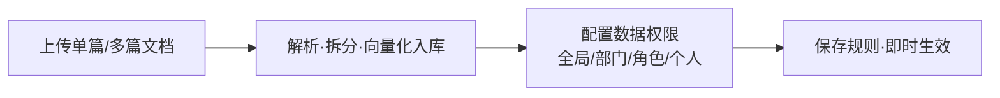
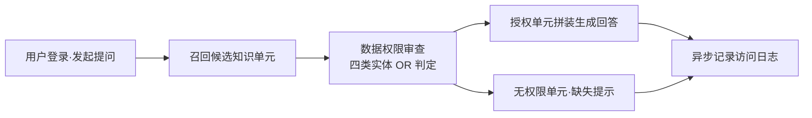
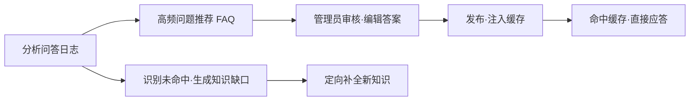

# 知识库管理平台（KBMS）产品需求文档（PRD）

| 项目 | 内容 |
| --- | --- |
| 文档名称 | 知识库管理平台（KBMS）产品需求文档 |
| 文档版本 | v1.0 |
| 关联需求编号 | 2.9 知识库管理平台 |
| 关联技术文档 | [知识库管理平台SPEC.md](./知识库管理平台SPEC.md)（技术选型、架构、数据模型、API、目录结构） |
| 主要读者 | 产品、前端、后端、测试、交付 |
| 交付形式 | 可运行前端 + 后端服务 + 数据库初始化脚本 + 示例知识文档 + 接口说明文档 + 完整业务演示链路 |
| 状态 | 待评审 |

---

## 1. 项目概述

### 1.1 背景

当前 `app/` 目录下已存在一个可独立运行的 RAG（检索增强生成）核心项目，能够完成完整的 PDF 导入、解析、切片、向量化、入库，以及基于知识库的问答查询。该核心项目采用 FastAPI + LangGraph，依赖 Milvus（向量库）、MongoDB（文档/会话存储）、MinIO（对象存储）、MinerU（PDF 解析）、BGE-M3（向量化）、DashScope/Qwen（LLM）等组件。

现有 RAG 核心偏"引擎"能力，缺少面向企业运营的**周边管理能力**：用户/角色/组织、知识单元的细粒度数据权限、AI 问答的登录态与鉴权、数据看板、知识沉淀（FAQ 挖掘与知识缺口识别）。本平台在此基础上新增 **admin 管理端 + 前端 + 关系库**，形成一套完整的知识库管理平台。

### 1.2 项目目标

实现一个集 **知识维护、多维权限管理、AI 问答鉴权检索、数据看板与知识自动沉淀** 于一体的知识库管理平台，支持：

- 单篇与批量知识导入；
- 细粒度操作权限与数据权限控制；
- 智能体鉴权召回；
- 热点 FAQ 挖掘沉淀；
- 知识缺口识别。

### 1.3 交付形式

1. 可运行前端（admin-frontend）；
2. 后端服务（admin 后端 + 复用/扩展 RAG 核心）；
3. 数据库初始化脚本（PostgreSQL DDL + Alembic 迁移 + 种子数据）；
4. 示例知识文档数据；
5. 接口说明文档；
6. 完整业务演示链路。

### 1.4 术语定义

| 术语 | 定义 |
| --- | --- |
| 知识单元（Knowledge Unit） | 一个独立导入的文档或手册，作为权限控制与检索的最小组织单位，拥有唯一标识 `unit_code` |
| 切片（Chunk） | 知识单元经解析、切分后生成的最小检索片段，存于 Milvus，通过 `file_title` 反向归属到知识单元 |
| 数据权限 | 决定"谁能看到哪个知识单元"的访问权限，支持 global / department / role / user 四类实体 |
| 操作权限 | 决定"谁能执行哪些功能/按钮/接口"的 RBAC 权限 |
| FAQ 缓存 | 已审核发布的标准问答对，命中后直接返回，降低模型 Token 消耗 |
| 知识缺口 | AI 检索未命中或置信度过低的提问记录，需补充知识的提示项 |

---

## 2. 现状与既有 RAG 核心

### 2.1 既有 RAG 核心

现有 `app/` 是一套 FastAPI + LangGraph 的 RAG 引擎，包含两套工作流：

- **导入工作流**：`node_entry → node_pdf_to_md(MinerU) → node_md_img → node_document_split(切分) → node_item_name_recognition → node_bge_embedding → node_import_milvus`。
- **查询工作流**：`node_item_name_confirm → {node_search_embedding / _hyde / node_web_search_mcp} → node_rrf(融合) → node_rerank(重排) → node_answer_output(SSE 流式)`。

底层依赖 Milvus（向量库）、MongoDB（会话存储）、MinIO（对象存储）及 MinerU / BGE-M3 / DashScope 等外部能力。

> 技术架构图见 [SPEC §2](./知识库管理平台SPEC.md)。

### 2.2 与 admin 相关的既有集成预留（重要）

现有代码已为 KBMS admin 预留了以下集成点，本平台直接复用：

| 既有资产 | 位置 | 用途 |
| --- | --- | --- |
| `POST /api/v1/recall` | `app/api/v1/recall_router.py` | 召回接口，返回命中知识单元的 **去重 `file_title` + 分数**，作为跨系统锚点供 admin 映射 KnowledgeUnit 并执行鉴权 |
| `POST /api/v1/embed` | `app/api/v1/embed_router.py` | 向量接口，返回 dense + sparse 向量，供 FAQ 语义缓存匹配与知识缺口聚类复用 |
| `focus_file_titles` 字段 | `app/schema/query_schema.py` | 查询请求中的鉴权白名单透传字段 |
| `kbms-postgres` / `kb-admin` / `admin-frontend-build` | `app/docker-compose.yml` | 已定义的关系库、admin 后端（:8002）、前端构建服务编排 |
| KBMS Admin 环境变量 | `app/.env.example` | `DATABASE_URL`、`RAG_BASE_URL`、JWT、FAQ 挖掘阈值等配置项 |

### 2.3 关键跨系统锚点：知识单元 ↔ file_title

- 知识单元（`knowledge_units`）在 PostgreSQL 中存储元数据，其 `source_file_name` 与 Milvus `chunks.file_title` 保持一致。
- RAG 召回接口返回 `file_title`，admin 据此映射到 `knowledge_units.id / unit_code`，再调用数据权限引擎完成鉴权过滤。

---

## 3. 总体范围与架构概述

在既有 RAG 核心之上新增三个交付物，形成完整链路：

1. **admin 后端**（`:8002`）：认证鉴权、组织架构、知识单元元数据、数据权限引擎、AI 鉴权检索、看板统计、知识沉淀、FAQ 缓存。
2. **admin 前端**：登录、组织/权限、知识维护、AI 对话、看板、沉淀等页面。
3. **关系库**（PostgreSQL）：承载用户/角色/部门/知识单元/权限/日志/FAQ/缺口等业务数据。

> 技术选型及理由、架构图（mermaid）、部署拓扑详见 [SPEC §1、§2](./知识库管理平台SPEC.md)。

---

## 4. 用户角色与权限

### 4.1 角色定义

| 角色 | 角色编码（role_code） | 职责 |
| --- | --- | --- |
| 系统管理员 | `system_admin` | 用户/角色/部门维护；菜单与操作权限配置；监控看板与 Token 消耗 |
| 知识管理员 | `knowledge_admin` | 知识单元导入/编辑/删除；配置数据权限；审核发布 FAQ；维护知识缺口 |
| 普通用户/提问者 | `user` | 登录后进行 AI 智能问答；基于被分配的数据权限获取回答；无权限时收到缺失提示 |

### 4.2 权限模型

- **操作权限（RBAC）**：按角色配置"功能菜单访问 + 按钮/接口级操作权限"，通过 `role_permissions` 落库（`permission_type` 区分 `menu` / `button`）。
- **数据权限（四维混合）**：对每个知识单元配置 `global / department / role / user` 四类实体，支持多实体混合，满足任意一种（OR）即放行。

---

## 5. 功能需求

### 5.1 认证与会话

- 用户名 + 密码登录，签发 JWT（access_token + refresh_token）。
- 登录态校验中间件，未登录/令牌过期返回 401。
- 个人中心：展示当前用户身份、所属部门、拥有的角色。
- 重置密码、启停用用户。

### 5.2 组织架构管理

- **用户管理**：用户列表（含部门归属、角色关联）、新增、编辑、重置密码、启用/停用。
- **角色管理**：角色名称、角色编码、操作权限树（增删改查、AI 访问权限）。
- **部门管理**：部门树形结构、负责人、成员关联。

### 5.3 知识维护

- **单文件导入**：上传单个 PDF / Markdown / Word / TXT。
- **批量导入**：多文件/目录批量上传、并发解析、进度轮询。
- **知识单元拆分与解析**：导入后经 RAG 解析为切片并向量化入库。
- **知识单元 CRUD**：编号、标题、正文内容、摘要、分类、标签、附件、状态、版本管理。
- **知识版本与状态管理**：草稿/已发布/停用等状态流转。

### 5.4 AI 检索与问答鉴权

- 用户登录态强制校验。
- 智能体知识召回（复用 RAG 召回/查询能力）。
- 数据权限鉴权过滤（调用数据权限引擎）。
- 未授权拦截 + 友好提示（召回但无权限的单元在回复/引用中明确提示缺失）。
- 问答会话管理（复用 RAG 会话历史接口）。

### 5.5 数据看板

- 指标卡片：Agent 访问次数、独立访问人数（UV）、知识单元总数、总 Token 消耗、平均响应时间。
- 排行榜：高频问题 TOP 榜、最常访问知识单元 TOP 榜。
- 趋势与分布：按日/周访问趋势、Token 消耗走势、响应时间分布。

### 5.6 知识沉淀

- **FAQ 自动推荐与审核**：语义去重 + 频次聚合，达到阈值自动生成推荐；管理员审核（通过/驳回）、编辑标准答案。
- **已发布 FAQ 库**：管理已上线 FAQ 与缓存状态。
- **知识缺口**：识别未命中/低置信度提问，聚合聚类，供一键创建关联知识单元。

---

## 6. 页面需求

| 页面 | 核心内容 |
| --- | --- |
| 登录与个人中心 | 登录表单；当前身份/部门/角色展示 |
| 用户管理 | 用户列表、部门归属、角色关联、增改、重置密码、启停用 |
| 角色管理 | 角色名称/编码、操作权限树（增删改查、AI 访问） |
| 部门管理 | 部门树、负责人与成员关联 |
| 知识导入中心 | 单文件/多文件/目录上传（拖拽）、格式支持、解析进度与结果展示 |
| 知识单元列表 | 编号、标题、分类、格式、数据权限摘要、创建人、更新时间、状态；搜索/筛选/查看/编辑/删除 |
| 知识单元编辑/详情 | 编辑标题、正文、标签、附件；设置数据权限实体（全局/部门/角色/个人混合） |
| AI 对话鉴权工作台 | 登录后进入；提问框、历史对话列表、流式 Markdown 回复、知识引用来源卡片、无权限缺失提示 |
| 数据看板 | 指标卡、TOP 榜、趋势与分布图 |
| 知识沉淀管理 | FAQ 推荐列表（频次/关联单元/建议答案）、审核操作、已发布 FAQ 库、知识缺口列表与一键建档 |

---

## 7. 核心业务流程

### 7.1 知识批量维护与权限配置流程

### 7.2 AI 鉴权问答流转流程

### 7.3 知识沉淀与 FAQ 闭环流程

> 上述流程的技术实现（含参与者与时序）详见 [SPEC §5](./知识库管理平台SPEC.md)。

---

## 8. 数据模型

知识库管理平台共 10 张业务表：`users`、`departments`、`roles`、`user_roles`、`role_permissions`、`knowledge_units`、`unit_permissions`、`qa_access_logs`、`faqs`、`knowledge_gaps`。

> 完整字段类型、主外键关系、索引/约束与 ER 图（mermaid）详见 [SPEC §3](./知识库管理平台SPEC.md)。

---

## 9. 接口清单

以下为需求 2.9.8 明确要求的接口（admin 侧前缀 `/api`），完整 RESTful 请求/响应、状态码与补充接口见 [SPEC §4](./知识库管理平台SPEC.md)。

| 接口 | 说明 |
| --- | --- |
| `POST /api/auth/login` | 登录，返回 `access_token`、`user_info`、`permissions` |
| `GET /api/org/departments` | 部门树形列表 |
| `POST /api/org/users` / `PUT /api/org/users/{id}` | 用户新增/编辑 |
| `GET /api/org/roles` / `POST /api/org/roles/{id}/permissions` | 角色列表 / 权限分配 |
| `POST /api/knowledge/import` | 单/多文件批量上传与解析入库 |
| `GET /api/knowledge/units` | 按标题/分类/状态分页查询 |
| `GET /api/knowledge/units/{id}` | 详情 + 已配置数据权限 |
| `PUT /api/knowledge/units/{id}` | 更新内容 |
| `POST /api/knowledge/units/{id}/permissions` | 批量配置数据权限实体 |
| `DELETE /api/knowledge/units` | 批量删除 |
| `POST /api/knowledge/check-permissions` | 鉴权判定，返回 `authorized_unit_ids` / `unauthorized_unit_ids` |
| `POST /api/ai/chat/stream` | 鉴权问答，SSE 流式 + 权限缺失提示 |
| `GET /api/dashboard/metrics` | 访问总次数、UV、单元数、Token 总量、平均耗时 |
| `GET /api/dashboard/rankings/questions` | 高频问题 TOP 榜 |
| `GET /api/dashboard/rankings/units` | 最常访问单元 TOP 榜 |
| `GET /api/dashboard/stats/tokens` | Token 消耗与响应时间趋势 |
| `GET /api/settlement/faqs/recommendations` | 待审核 FAQ 推荐列表 |
| `POST /api/settlement/faqs/{id}/review` | 审核（`approve` / `reject`） |
| `GET /api/settlement/knowledge-gaps` | 知识缺口列表与未命中频次 |

---

## 10. 前端模块要求

| 模块 | 职责 |
| --- | --- |
| 认证与权限控制模块 | 管理 Token / 登录态；动态菜单渲染；按钮级操作权限控制 |
| 组织架构管理模块 | 用户/角色/部门树形与列表展示、CRUD、角色权限分配 |
| 知识管理与批量导入模块 | 拖拽上传、批量并发上传、解析进度轮询、知识单元 CRUD |
| 数据权限配置组件 | 统一权限选择弹窗：全局公开 / 多选部门 / 多选角色 / 多选人员 |
| AI 对话工作台模块 | 多轮对话、流式 Markdown 渲染、知识引用卡片、权限缺失提示卡片 |
| 看板与图表模块 | 指标统计卡、高频问题榜、知识热度榜、Token/耗时趋势图 |
| 知识沉淀模块 | FAQ 推荐列表、审核流转、知识缺口列表、快速建档转化 |

---

## 11. 后端与服务模块要求

| 服务模块 | 职责 |
| --- | --- |
| 认证鉴权模块 | 用户认证、JWT 签发/校验、RBAC 操作权限拦截 |
| 组织架构服务 | 用户、角色、部门树及人员-角色/部门映射关系 |
| 知识单元管理服务 | 文档上传、格式解析、文本切片、知识单元 CRUD 与向量化同步 |
| 数据权限引擎 | 计算并校验用户对指定知识单元集合的访问权限，输出允许/拒绝列表 |
| AI 鉴权检索服务 | 会话管理、向量/关键字混合召回、权限过滤、Prompt 组装、流式回答、权限缺失提示 |
| 数据看板统计服务 | 异步记录问答访问日志，聚合访问量/排行榜/性能指标 |
| 知识沉淀挖掘服务 | 定时/聚类挖掘高频相似问题生成 FAQ 推荐；识别知识缺口 |
| FAQ 缓存服务 | 管理已发布 FAQ，精确/语义相似度匹配，快速应答缓存 |

---

## 12. 看板与知识沉淀规则

### 12.1 数据看板聚合规则

- 每次问答记录一条独立日志，提取提问词、命中知识单元、Token 计数、接口响应时长。
- 每日与实时汇总访问指标、热度榜单、性能分布。

### 12.2 FAQ 挖掘与审核发布规则

- 对历史提问语义去重 + 频次聚合；某类问题频次达到阈值时生成推荐 FAQ。
- 管理员审核确认后标记 `published` 并写入缓存。
- 智能体对话优先匹配已发布 FAQ 缓存，命中直接返回，降低 Token 消耗。

### 12.3 知识缺口识别规则

- 提问召回相似度低于阈值、或无可用知识单元支撑的问答记录，标记为知识缺口。
- 统计频次并聚合，为知识管理员补全提供依据。

---

## 13. 非功能需求

- **安全**：密码 bcrypt 散列；JWT 签名校验；接口级 RBAC 拦截；数据权限引擎强制过滤。
- **性能**：FAQ 缓存命中尽量绕过 LLM；看板统计异步写入；导入批处理并发解析。
- **可观测**：统一日志、问答日志留痕、任务进度可见。
- **可维护**：分层（router/service/repository）+ 端口抽象，与 RAG 核心通过 HTTP 解耦。

---

## 14. 验收标准

- ✅ 完成用户登录、角色管理、部门管理与菜单/按钮级操作权限分配。
- ✅ 通过界面完成单篇与批量文档导入，成功拆分文档为知识单元并检索入库。
- ✅ 对知识单元执行增删改查，支持混合配置全局/部门/角色/个人四类数据权限。
- ✅ 满足部门/角色/个人/全局中任意一种权限时正常访问知识单元。
- ✅ AI 对话强制校验登录态并调用鉴权接口过滤未授权单元，对无权限召回项输出明确权限缺失提示。
- ✅ 数据看板正确展示访问次数、独立人数、知识单元数、常见问题榜、知识热度榜、Token 消耗与响应时间趋势。
- ✅ 自动从历史对话挖掘高频问题生成推荐 FAQ，支持管理员审核发布并写入缓存加速应答。
- ✅ 自动识别未命中问题生成知识缺口列表，支持查看提问频次。

---

## 15. 交付物清单

| 交付物 | 说明 |
| --- | --- |
| admin 后端 | `admin/` 目录，FastAPI 应用（:8002） |
| admin 前端 | `admin-frontend/` 目录，Vue3 + TS |
| 数据库脚本 | Alembic 迁移 + 种子数据初始化脚本 |
| 示例知识文档 | 供演示导入的 PDF/MD 示例文档 |
| 接口文档 | OpenAPI + 接口说明 |
| 部署编排 | `docker-compose.yml` |
| 演示链路 | 导入 → 配权 → 鉴权问答 → 看板 → 沉淀 全流程 |

---

## 16. 风险与依赖

| 风险/依赖 | 说明 | 缓解 |
| --- | --- | --- |
| 跨系统锚点一致性 | `source_file_name` 与 RAG `file_title` 必须一致 | 导入时统一锚点生成；单测校验 |
| RAG 召回侧需输出 `file_title` | 权限过滤依赖召回结果带 file_title | 复用既有 `/api/v1/recall` |
| FAQ 语义匹配需向量 | admin 无向量模型 | 复用 `/api/v1/embed` |
| Redis 缓存为建议新增 | 需求要求"高速缓存"，当前 compose 无 Redis | 新增 `kbms-redis`，或降级为进程内/DB 缓存 |
| 批量并发解析资源 | 大批量导入耗费 GPU/内存 | 任务队列限流、进度轮询、失败重试 |

---

## 附：技术规范索引

| 内容 | SPEC 章节 |
| --- | --- |
| 技术选型与理由 | §1 |
| 系统架构图 / 部署拓扑 | §2 |
| 数据模型（ER 图 + 字段 + 关系） | §3 |
| RESTful API 全量定义 | §4 |
| 核心流程时序图 / 权限流程图 | §5 |
| AI 鉴权检索集成协议 | §6 |
| FAQ 缓存 / 知识缺口设计 | §7 |
| 项目目录结构 | §8 |
| 环境变量 / 数据库初始化 | §9、§10 |
| 现有代码映射速查 | §11 |