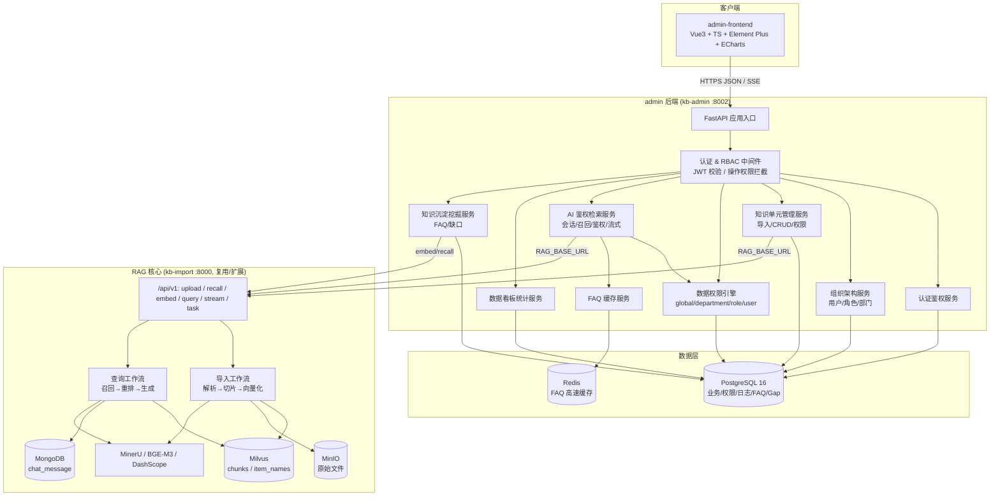
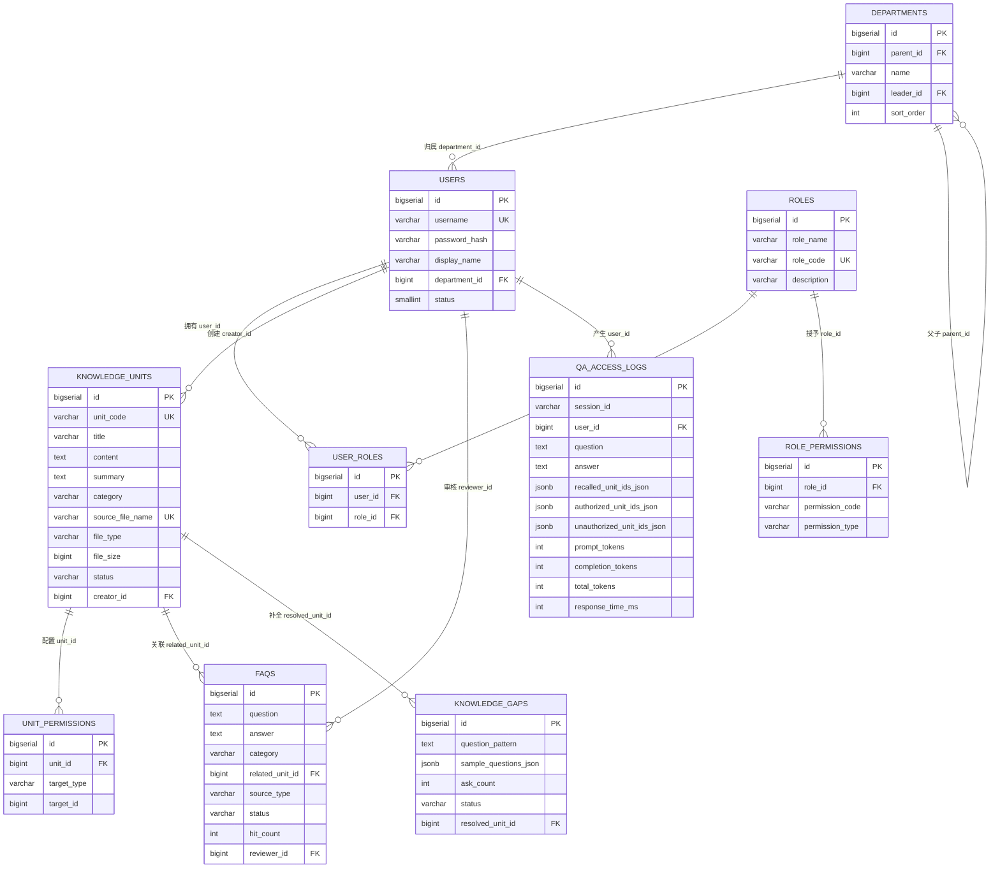
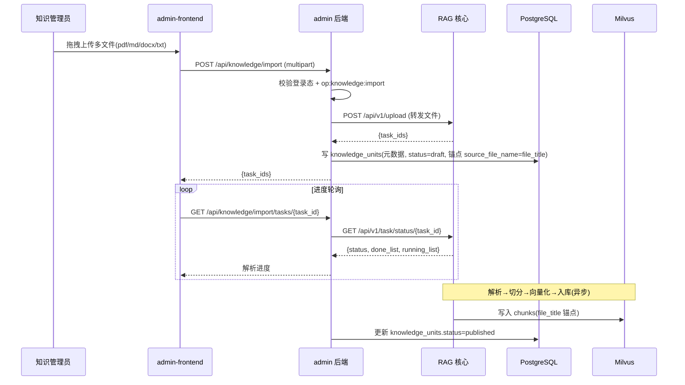
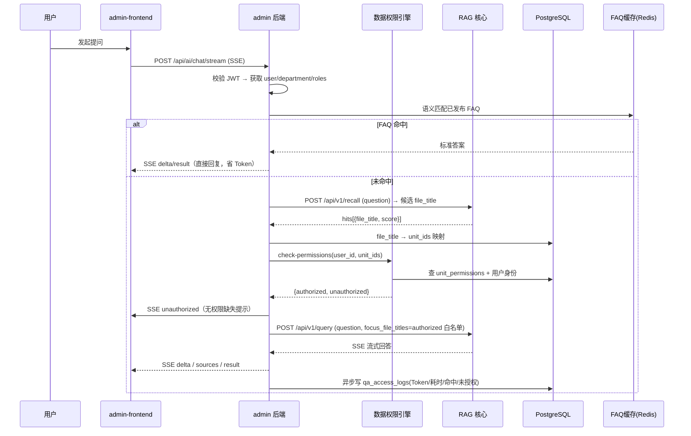
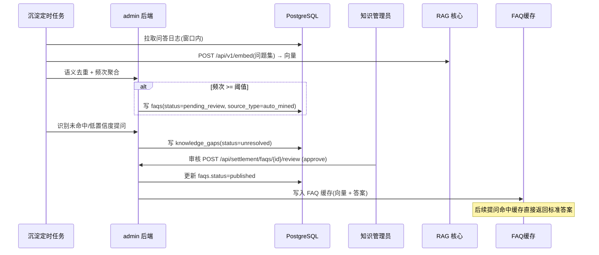
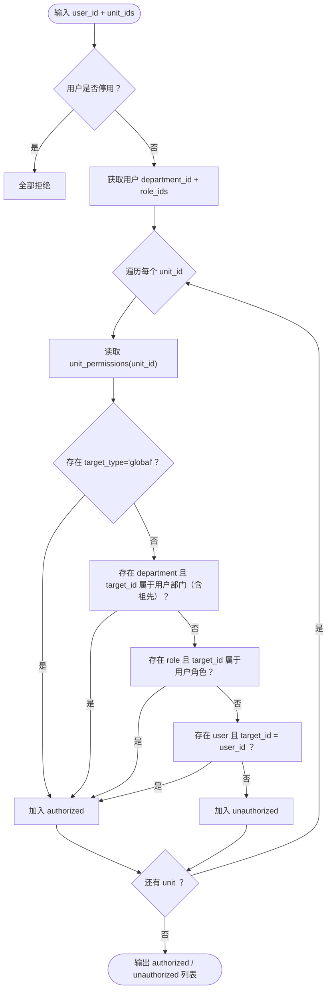

# 知识库管理平台（KBMS）技术规范文档（SPEC）

| 项目 | 内容 |
| --- | --- |
| 文档名称 | 知识库管理平台（KBMS）技术规范文档 |
| 文档版本 | v1.0 |
| 关联文档 | 《知识库管理平台PRD.md》 |
| 主要读者 | 后端、前端、测试、运维 |
| 状态 | 待评审 |

> 本规范为《知识库管理平台PRD》的技术落地方案，承载技术选型、系统架构、数据模型、API 接口、目录结构等实现层内容。

---

## 1. 技术选型与理由

### 1.1 总体选型

| 层 | 选型 | 理由 |
| --- | --- | --- |
| 后端语言 | Python 3.11+ | 与既有 RAG 核心（`app/`）同栈，`asyncpg`/`pydantic`/`SQLAlchemy 2.0` 生态成熟，便于团队统一维护 |
| Web 框架 | FastAPI | 天然支持 async、Pydantic 数据校验、自动生成 OpenAPI 文档（交付物"接口说明文档"可直接产出）；与 RAG 核心同框架 |
| ORM | SQLAlchemy 2.0（async）+ asyncpg | 异步驱动与 FastAPI 匹配；2.0 声明式 + typed ORM，迁移可控 |
| 数据库迁移 | Alembic | 版本化 schema 演进，满足"数据库初始化脚本"交付 |
| 关系库 | PostgreSQL 16 | JSONB 原生支持（`*_json` 字段）、树形递归查询（departments 自引用）、窗口函数适配看板聚合 |
| 缓存 | Redis | FAQ 高频问答要求"高速缓存 + 语义相似度匹配"低时延命中；支持 `SET`/`GET` 与 TTL |
| 认证 | JWT（python-jose）+ bcrypt（passlib） | 无状态鉴权，RBAC 拦截中间件校验签名与过期；密码 bcrypt 单向散列 |
| 前端框架 | Vue 3 + TypeScript + Vite | 组合式 API 适合中后台；`pnpm`（compose 已指定）冷启动快 |
| UI 组件库 | Element Plus | 中后台表格/树/表单/弹窗组件齐全，与部门树、权限树、知识列表高度匹配 |
| 图表 | ECharts | 看板趋势/分布/榜单可视化能力强、生态稳定 |
| 状态管理 / 路由 | Pinia / vue-router | Vue 3 官方推荐，管理登录态、动态菜单、权限码 |
| Markdown / 流式渲染 | markdown-it + highlight.js（或 markdown-it-chain） | AI 对话流式 Markdown 渲染 |

### 1.2 关键决策说明

1. **admin 与 RAG 解耦（HTTP 集成）**：admin 通过 `RAG_BASE_URL` 调用 RAG 的 `/api/v1`（`upload`/`recall`/`embed`/`query`/`stream`/`task/status`），避免 admin 重复加载 BGE-M3 等重模型，职责单一、可独立扩缩容。
2. **数据权限最终解释权在 admin**：RAG 只负责"召回候选 + 按白名单偏置"，鉴权计算集中在 admin 的数据权限引擎，保证一致性与可测试性。
3. **FAQ 缓存语义匹配复用 RAG `/embed`**：admin 不本地部署向量模型，语义相似度通过调用 RAG 的 BGE-M3 向量接口实现，存入 Redis 供快速命中。
4. **看板/沉淀基于事实表 `qa_access_logs` 异步写入**：问答主链路不阻塞，统计聚合离线/近实时计算。

---

## 2. 系统总体架构

### 2.1 架构图



### 2.2 职责边界

| 组件 | 负责 | 不负责 |
| --- | --- | --- |
| RAG 核心 | 解析、切片、向量化、召回、重排、LLM 生成（含 SSE） | 用户/权限/日志/看板/沉淀业务 |
| admin 后端 | 认证、RBAC、数据权限、知识元数据、看板、沉淀、FAQ 缓存 | 向量检索算法、模型推理 |
| admin 前端 | 页面交互、权限控制展示、图表渲染 | 权限判定逻辑（以服务端为准） |

---

## 3. 数据模型设计

### 3.1 ER 图



> 约定：所有表统一带 `created_at`、`updated_at`（`TIMESTAMPTZ`，DEFAULT `now()`），ER 图中省略。`USER_ROLES`/`ROLE_PERMISSIONS` 联合唯一约束见下表。

### 3.2 表结构明细

#### 3.2.1 users（用户）

| 字段 | 类型 | 约束 | 说明 |
| --- | --- | --- | --- |
| id | BIGSERIAL | PK | 主键 |
| username | VARCHAR(64) | NOT NULL, UNIQUE | 登录名 |
| password_hash | VARCHAR(255) | NOT NULL | bcrypt 散列 |
| display_name | VARCHAR(128) | NULL | 显示名 |
| department_id | BIGINT | FK → departments.id | 所属部门 |
| status | SMALLINT | NOT NULL DEFAULT 1 | 1=启用 0=停用 |
| created_at / updated_at | TIMESTAMPTZ | DEFAULT now() | 时间戳 |

#### 3.2.2 departments（部门）

| 字段 | 类型 | 约束 | 说明 |
| --- | --- | --- | --- |
| id | BIGSERIAL | PK | 主键 |
| parent_id | BIGINT | FK → departments.id，可空 | 父部门（自引用树） |
| name | VARCHAR(128) | NOT NULL | 名称 |
| leader_id | BIGINT | FK → users.id，可空 | 负责人 |
| sort_order | INT | NOT NULL DEFAULT 0 | 排序 |

#### 3.2.3 roles（角色）

| 字段 | 类型 | 约束 | 说明 |
| --- | --- | --- | --- |
| id | BIGSERIAL | PK | 主键 |
| role_name | VARCHAR(64) | NOT NULL | 名称 |
| role_code | VARCHAR(64) | NOT NULL, UNIQUE | 编码（system_admin/knowledge_admin/user） |
| description | VARCHAR(255) | NULL | 描述 |

#### 3.2.4 user_roles（用户-角色）

| 字段 | 类型 | 约束 | 说明 |
| --- | --- | --- | --- |
| id | BIGSERIAL | PK | 主键 |
| user_id | BIGINT | FK → users.id | 用户 |
| role_id | BIGINT | FK → roles.id | 角色 |
| — | — | UNIQUE(user_id, role_id) | 防重复 |

#### 3.2.5 role_permissions（角色-操作权限）

| 字段 | 类型 | 约束 | 说明 |
| --- | --- | --- | --- |
| id | BIGSERIAL | PK | 主键 |
| role_id | BIGINT | FK → roles.id | 角色 |
| permission_code | VARCHAR(64) | NOT NULL | 权限编码 |
| permission_type | VARCHAR(16) | NOT NULL | `menu` / `button` |
| — | — | UNIQUE(role_id, permission_code) | — |

#### 3.2.6 knowledge_units（知识单元）

| 字段 | 类型 | 约束 | 说明 |
| --- | --- | --- | --- |
| id | BIGSERIAL | PK | 主键 |
| unit_code | VARCHAR(64) | NOT NULL, UNIQUE | 唯一标识 |
| title | VARCHAR(255) | NOT NULL | 标题 |
| content | TEXT | NULL | 正文 |
| summary | TEXT | NULL | 摘要 |
| category | VARCHAR(128) | NULL, INDEX | 分类 |
| source_file_name | VARCHAR(255) | NOT NULL, UNIQUE | 源文件名，**跨系统锚点↔RAG `file_title`** |
| file_type | VARCHAR(16) | NOT NULL | pdf/md/docx/txt |
| file_size | BIGINT | DEFAULT 0 | 大小 |
| status | VARCHAR(16) | NOT NULL DEFAULT 'draft' | draft/published/archived |
| creator_id | BIGINT | FK → users.id | 创建人 |

#### 3.2.7 unit_permissions（知识单元数据权限）

| 字段 | 类型 | 约束 | 说明 |
| --- | --- | --- | --- |
| id | BIGSERIAL | PK | 主键 |
| unit_id | BIGINT | FK → knowledge_units.id ON DELETE CASCADE | 知识单元 |
| target_type | VARCHAR(16) | NOT NULL | `global`/`department`/`role`/`user` |
| target_id | BIGINT | NOT NULL DEFAULT 0 | 实体 ID（global=0） |
| — | — | INDEX(unit_id), INDEX(target_type,target_id) | — |

#### 3.2.8 qa_access_logs（问答访问日志，事实表）

| 字段 | 类型 | 约束 | 说明 |
| --- | --- | --- | --- |
| id | BIGSERIAL | PK | 主键 |
| session_id | VARCHAR(64) | NOT NULL, INDEX | 会话 |
| user_id | BIGINT | FK → users.id | 用户 |
| question / answer | TEXT | NULL | 问/答 |
| recalled_unit_ids_json | JSONB | NULL | 召回单元 ID 数组 |
| authorized_unit_ids_json | JSONB | NULL | 授权单元 ID 数组 |
| unauthorized_unit_ids_json | JSONB | NULL | 未授权单元 ID 数组 |
| prompt_tokens / completion_tokens / total_tokens | INT | DEFAULT 0 | Token |
| response_time_ms | INT | DEFAULT 0 | 耗时 |
| created_at | TIMESTAMPTZ | INDEX | 时间 |

#### 3.2.9 faqs（FAQ 问答对）

| 字段 | 类型 | 约束 | 说明 |
| --- | --- | --- | --- |
| id | BIGSERIAL | PK | 主键 |
| question / answer | TEXT | NOT NULL | 标准问答 |
| category | VARCHAR(128) | NULL | 分类 |
| related_unit_id | BIGINT | FK → knowledge_units.id | 关联单元 |
| source_type | VARCHAR(16) | NOT NULL | `manual`/`auto_mined` |
| status | VARCHAR(16) | NOT NULL DEFAULT 'pending_review', INDEX | pending_review/published/rejected |
| hit_count | INT | DEFAULT 0 | 命中次数 |
| reviewer_id | BIGINT | FK → users.id | 审核人 |
| reviewed_at | TIMESTAMPTZ | NULL | 审核时间 |

#### 3.2.10 knowledge_gaps（知识缺口）

| 字段 | 类型 | 约束 | 说明 |
| --- | --- | --- | --- |
| id | BIGSERIAL | PK | 主键 |
| question_pattern | TEXT | NOT NULL | 聚类代表问题 |
| sample_questions_json | JSONB | NULL | 样本问题数组 |
| ask_count | INT | DEFAULT 0 | 频次 |
| last_asked_at | TIMESTAMPTZ | NULL | 最近提问 |
| status | VARCHAR(16) | NOT NULL DEFAULT 'unresolved', INDEX | unresolved/resolved/ignored |
| resolved_unit_id | BIGINT | FK → knowledge_units.id | 补全单元 |

### 3.3 枚举与状态机

| 枚举字段 | 取值 | 说明 |
| --- | --- | --- |
| users.status | `1` / `0` | 启用/停用 |
| knowledge_units.status | `draft` → `published` → `archived` | 草稿/已发布/停用 |
| unit_permissions.target_type | `global` / `department` / `role` / `user` | 四类实体 |
| faqs.source_type | `manual` / `auto_mined` | 手工/自动挖掘 |
| faqs.status | `pending_review` → `published` / `rejected` | 待审/已发布/驳回 |
| knowledge_gaps.status | `unresolved` → `resolved` / `ignored` | 未解决/已解决/忽略 |

---

## 4. API 接口规范（RESTful）

### 4.1 通用约定

- 前缀：`/api`（与既有 RAG `/api/v1` 区分）。
- 认证：除 `POST /auth/login`、`POST /auth/refresh` 外，均需 `Authorization: Bearer <access_token>`。
- 统一响应结构：`{ "code": int, "message": str, "data": object|null }`。
- 分页参数：`page`(默认1)、`page_size`(默认20)；分页响应：`{ "items": [], "total": int, "page": int, "page_size": int }`。
- 列表类接口支持 `keyword`/`status` 等 query 过滤。
- 操作权限码：见 PRD §8.6 / 本规范 §3.2.5，中间件按 `role_permissions` 校验。

### 4.2 错误码约定

| code | 含义 |
| --- | --- |
| 200 | 成功 |
| 400 | 参数错误 |
| 401 | 未登录 / Token 过期 |
| 403 | 无操作权限 / 无数据权限 |
| 404 | 资源不存在 |
| 409 | 冲突（如用户名重复） |
| 500 | 服务异常 |

### 4.3 认证鉴权

| 方法 | 路径 | 权限 | 请求 | 响应 |
| --- | --- | --- | --- | --- |
| POST | `/api/auth/login` | 公开 | `{username, password}` | `{access_token, refresh_token, token_type, user_info, permissions}` |
| POST | `/api/auth/refresh` | 公开 | `{refresh_token}` | `{access_token}` |
| POST | `/api/auth/logout` | 登录 | — | 204 |
| GET | `/api/auth/me` | 登录 | — | `{id, username, display_name, department, roles, permissions}` |

**login 响应示例**

```json
{
  "code": 200, "message": "success",
  "data": {
    "access_token": "eyJ...", "refresh_token": "eyJ...", "token_type": "Bearer",
    "user_info": {"id": 1, "username": "admin", "display_name": "系统管理员", "department_id": 1},
    "permissions": ["menu:org:user", "op:knowledge:unit:create", "op:ai:chat"]
  }
}
```

### 4.4 组织架构

| 方法 | 路径 | 权限 | 说明 |
| --- | --- | --- | --- |
| GET | `/api/org/departments` | 登录 | 部门树形列表 |
| POST | `/api/org/departments` | `menu:org:dept` | 新增部门 |
| PUT | `/api/org/departments/{id}` | `menu:org:dept` | 编辑部门 |
| DELETE | `/api/org/departments/{id}` | `menu:org:dept` | 删除（有子/成员时拒绝） |
| GET | `/api/org/users` | `menu:org:user` | 用户分页（filter: keyword/department_id/status） |
| POST | `/api/org/users` | `menu:org:user` | 用户新增 |
| GET | `/api/org/users/{id}` | `menu:org:user` | 用户详情 |
| PUT | `/api/org/users/{id}` | `menu:org:user` | 用户编辑 |
| POST | `/api/org/users/{id}/password` | `menu:org:user` | 重置密码 |
| PATCH | `/api/org/users/{id}/status` | `menu:org:user` | 启用/停用 |
| GET | `/api/org/roles` | `menu:org:role` | 角色列表 |
| POST | `/api/org/roles` | `menu:org:role` | 角色新增 |
| PUT | `/api/org/roles/{id}` | `menu:org:role` | 角色编辑 |
| DELETE | `/api/org/roles/{id}` | `menu:org:role` | 删除（已关联用户时拒绝） |
| GET | `/api/org/roles/{id}/permissions` | `menu:org:role` | 查询角色权限 |
| POST | `/api/org/roles/{id}/permissions` | `menu:org:role` | 权限分配（全量覆盖） |

### 4.5 知识维护

| 方法 | 路径 | 权限 | 说明 |
| --- | --- | --- | --- |
| POST | `/api/knowledge/import` | `op:knowledge:import` | 单/多文件批量上传（multipart），返回任务 ID，异步解析入库 |
| GET | `/api/knowledge/import/tasks/{task_id}` | 登录 | 导入进度轮询（转发 RAG `/api/v1/task/status/{task_id}`） |
| GET | `/api/knowledge/units` | `op:knowledge:unit:read` | 分页查询（filter: keyword/category/status/file_type） |
| GET | `/api/knowledge/units/{id}` | `op:knowledge:unit:read` | 详情 + 已配置数据权限列表 |
| PUT | `/api/knowledge/units/{id}` | `op:knowledge:unit:update` | 更新标题/正文/分类/标签/状态 |
| DELETE | `/api/knowledge/units` | `op:knowledge:unit:delete` | 批量删除（body: `{ids:[]}`，同步删向量） |
| GET | `/api/knowledge/units/{id}/permissions` | `op:knowledge:unit:read` | 查询数据权限 |
| POST | `/api/knowledge/units/{id}/permissions` | `op:knowledge:unit:update` | 批量配置数据权限实体（全量覆盖） |

**import 响应示例**

```json
{ "code": 200, "message": "3 files submitted", "data": { "task_ids": ["t1","t2","t3"] } }
```

**配置数据权限请求示例**

```json
{
  "permissions": [
    {"target_type": "global", "target_id": 0},
    {"target_type": "department", "target_id": 3},
    {"target_type": "role", "target_id": 2},
    {"target_type": "user", "target_id": 10}
  ]
}
```

### 4.6 数据权限引擎

| 方法 | 路径 | 权限 | 说明 |
| --- | --- | --- | --- |
| POST | `/api/knowledge/check-permissions` | 登录（内部可被 AI 服务调用） | 判定用户对单元集合的可访问性 |

**请求 / 响应**

```json
// 请求
{ "user_id": 10, "unit_ids": [1, 2, 3] }
// 响应
{
  "code": 200, "message": "success",
  "data": { "authorized_unit_ids": [1, 3], "unauthorized_unit_ids": [2] }
}
```

### 4.7 AI 鉴权检索

| 方法 | 路径 | 权限 | 说明 |
| --- | --- | --- | --- |
| POST | `/api/ai/chat/stream` | `op:ai:chat`（登录态强制） | 鉴权问答，SSE 流式 + 权限缺失提示 |
| GET | `/api/ai/sessions` | 登录 | 我的会话列表 |
| GET | `/api/ai/sessions/{session_id}/messages` | 登录 | 历史消息（转发 RAG `/api/v1/history`） |
| DELETE | `/api/ai/sessions/{session_id}` | 登录 | 清空会话 |

**chat/stream 请求**

```json
{ "question": "XX 产品的售后政策？", "session_id": "s-123" }
```

**SSE 事件类型**

| event | data | 说明 |
| --- | --- | --- |
| `delta` | `{"delta": "..."}` | 流式文本增量 |
| `sources` | `{"items":[{"unit_id":1,"title":"...","source_file_name":"..."}]}` | 知识引用来源卡片 |
| `unauthorized` | `{"items":[{"unit_id":2,"title":"..."}]}` | 无权限召回项缺失提示 |
| `result` | `{"answer":"...","session_id":"..."}` | 完成 |
| `error` | `{"error":"..."}` | 异常 |

### 4.8 数据看板

| 方法 | 路径 | 权限 | 说明 |
| --- | --- | --- | --- |
| GET | `/api/dashboard/metrics` | `menu:dashboard` | 访问总次数、UV、单元数、Token 总量、平均耗时 |
| GET | `/api/dashboard/rankings/questions` | `menu:dashboard` | 高频问题 TOP 榜 |
| GET | `/api/dashboard/rankings/units` | `menu:dashboard` | 最常访问单元 TOP 榜 |
| GET | `/api/dashboard/stats/tokens` | `menu:dashboard` | Token 消耗与响应时间趋势（按日/周） |
| GET | `/api/dashboard/stats/access` | `menu:dashboard` | 访问趋势（按日/周） |

### 4.9 知识沉淀

| 方法 | 路径 | 权限 | 说明 |
| --- | --- | --- | --- |
| GET | `/api/settlement/faqs/recommendations` | `menu:settlement:faq` | 待审核 FAQ 推荐列表 |
| POST | `/api/settlement/faqs/{id}/review` | `op:settlement:faq:review` | 审核：`action`(approve/reject) + `edited_answer` |
| GET | `/api/settlement/faqs` | `menu:settlement:faq` | 已发布 FAQ 列表 |
| PUT | `/api/settlement/faqs/{id}` | `menu:settlement:faq` | 编辑 FAQ |
| DELETE | `/api/settlement/faqs/{id}` | `menu:settlement:faq` | 删除 |
| GET | `/api/settlement/knowledge-gaps` | `menu:settlement:gap` | 知识缺口列表 |
| POST | `/api/settlement/knowledge-gaps/{id}/resolve` | `menu:settlement:gap` | 一键创建知识单元补全 |
| PATCH | `/api/settlement/knowledge-gaps/{id}/ignore` | `menu:settlement:gap` | 忽略缺口 |

**review 请求示例**

```json
{ "action": "approve", "edited_answer": "标准化答案...", "category": "售后" }
```

---

## 5. 核心流程设计

### 5.1 知识批量导入流程（时序图）



### 5.2 AI 鉴权问答流程（时序图）



### 5.3 知识沉淀与 FAQ 闭环流程（时序图）



### 5.4 数据权限引擎判定流程（流程图）



> 满足四种实体中**任意一种（OR）**即放行；均不满足则拒绝。

---

## 6. AI 鉴权检索集成协议（与 RAG 契约）

| 能力 | RAG 接口 | 方向 | 说明 |
| --- | --- | --- | --- |
| 候选召回 | `POST /api/v1/recall` `{query, top_k, item_names}` | admin → RAG | 返回去重 `file_title + score`，映射知识单元 |
| 向量化 | `POST /api/v1/embed` `{texts[]}` | admin → RAG | 返回 dense/sparse，FAQ 缓存与缺口聚类复用 |
| 鉴权问答 | `POST /api/v1/query` `{query, session_id, is_stream, focus_file_titles}` | admin → RAG | `focus_file_titles` = 已鉴权白名单 |
| 流式结果 | `GET /api/v1/stream/{session_id}` | FE ← admin ← RAG | SSE 转发（或 admin 直接代管 SSE） |
| 导入 | `POST /api/v1/upload` | admin → RAG | 委托解析/切分/向量化 |
| 任务进度 | `GET /api/v1/task/status/{task_id}` | admin → RAG | 进度轮询 |
| 会话历史 | `GET /api/v1/history/{session_id}` | admin → RAG | 历史消息 |

**跨系统锚点契约**：`knowledge_units.source_file_name` 必须恒等于 RAG 侧 `file_title`（= 源文件名），导入时由 admin 统一生成并保证幂等。

---

## 7. FAQ 缓存与知识缺口设计

### 7.1 FAQ 缓存

- 审核 `approve` 时：调用 RAG `/embed` 生成问题向量，写入 Redis：`faq:index`（语义检索用向量索引，可选用 RediSearch 或轻量 ANN）+ `faq:{id}`（问答正文）。
- 命中策略：提问向量与已发布 FAQ 向量做余弦相似度，`sim >= FAQ_MATCH_THRESHOLD`（默认 0.85）则命中，`hit_count++`。
- 未命中：回落 AI 鉴权问答主链路。

### 7.2 知识缺口聚类

- 对 `qa_access_logs` 中"召回相似度 < 阈值"或"authorized 为空"的提问，调用 `/embed` 计算向量，用聚类（如 agglomerative / 简化 K-Means）聚合为 `question_pattern`，更新 `ask_count` 与 `sample_questions_json`。

---

## 8. 项目目录结构

### 8.1 admin 后端（`admin/`，构建上下文）

> 与 `app/docker-compose.yml` 中 `kb-admin`（`uvicorn admin.main:app`、context `./admin`、volume `admin/static/dist`）保持一致。

```
admin/
├── Dockerfile
├── pyproject.toml                 # 依赖声明
├── alembic.ini
├── alembic/
│   ├── env.py
│   └── versions/                  # 迁移脚本
├── scripts/
│   └── init_seed.py               # 种子数据(初始超管/角色/权限码)
├── admin/
│   ├── __init__.py
│   ├── main.py                    # FastAPI 入口
│   ├── config.py                  # Settings(pydantic-settings)
│   ├── database.py                # async engine / session
│   ├── core/
│   │   ├── security.py            # JWT 签发/校验、bcrypt、RBAC 依赖
│   │   ├── deps.py                # DI 依赖
│   │   └── exceptions.py          # 统一异常
│   ├── models/                    # SQLAlchemy ORM
│   │   ├── user.py
│   │   ├── org.py                 # departments/roles/user_roles/role_permissions
│   │   ├── knowledge.py           # knowledge_units/unit_permissions
│   │   ├── log.py                 # qa_access_logs
│   │   └── settlement.py          # faqs/knowledge_gaps
│   ├── schemas/                   # Pydantic v2
│   ├── api/                       # 路由层
│   │   ├── v1/
│   │   │   ├── auth.py
│   │   │   ├── org.py
│   │   │   ├── knowledge.py
│   │   │   ├── ai.py
│   │   │   ├── dashboard.py
│   │   │   └── settlement.py
│   │   └── deps.py
│   ├── services/                  # 业务层
│   │   ├── auth_service.py
│   │   ├── org_service.py
│   │   ├── knowledge_service.py
│   │   ├── permission_engine.py   # 数据权限引擎
│   │   ├── ai_chat_service.py
│   │   ├── dashboard_service.py
│   │   ├── settlement_service.py  # FAQ 挖掘/审核/缺口
│   │   └── faq_cache_service.py
│   ├── integrations/              # 外部集成(RAG HTTP client)
│   │   └── rag_client.py
│   ├── repositories/              # 数据访问层
│   └── static/
│       └── dist/                  # 前端构建产物
```

### 8.2 admin 前端（`admin-frontend/`）

```
admin-frontend/
├── package.json
├── pnpm-lock.yaml
├── vite.config.ts
├── tsconfig.json
├── index.html
└── src/
    ├── main.ts
    ├── App.vue
    ├── router/                    # 动态路由(按菜单权限)
    ├── stores/                    # Pinia(auth/permission)
    ├── api/                       # 接口封装(axios/SSE)
    ├── layouts/                   # 布局
    ├── views/
    │   ├── login/
    │   ├── dashboard/
    │   ├── org/                   # user/role/dept
    │   ├── knowledge/             # import/unit list/unit detail
    │   ├── chat/                  # AI 对话工作台
    │   └── settlement/            # faq/gap
    ├── components/
    │   ├── PermissionDialog.vue   # 数据权限四维选择弹窗
    │   ├── MarkdownViewer.vue     # 流式 Markdown 渲染
    │   └── SourceCiteCard.vue     # 引用/权限缺失卡片
    └── utils/
```

---

## 9. 环境变量与配置

| 变量 | 说明 | 来源 |
| --- | --- | --- |
| `DATABASE_URL` | async DSN（asyncpg） | `app/.env.example` 已含 |
| `DATABASE_SYNC_URL` | Alembic 同步 DSN | 已含 |
| `RAG_BASE_URL` | RAG 引擎入口 | 已含 |
| `JWT_SECRET` / `JWT_ALGORITHM` | 签名密钥/算法 | 已含 |
| `JWT_ACCESS_TTL_MIN` / `JWT_REFRESH_TTL_DAY` | 令牌有效期 | 已含 |
| `INITIAL_SUPERUSER_*` | 初始超管 | 已含 |
| `FAQ_MIN_FREQ_THRESHOLD` | FAQ 挖掘频次阈值 | 已含 |
| `FAQ_MIN_WINDOW_DAYS` | 统计窗口 | 已含 |
| `FAQ_MINER_INTERVAL_MIN` | 挖掘调度间隔 | 已含 |
| `FAQ_MATCH_THRESHOLD` | 缓存语义命中阈值 | 已含 |
| `REDIS_URL` | Redis 连接（**建议新增**） | 需补 |
| `CORS_ALLOW_ORIGINS` | 跨域来源 | 已含 |

---

## 10. 数据库初始化与种子数据

- Alembic 迁移建全部 10 张表 + 唯一约束 + 索引（见 §3.2）。
- `scripts/init_seed.py` 种子内容：初始超管 `admin`、内置角色 `system_admin`/`knowledge_admin`/`user`、菜单与操作权限码全集、示例部门树、示例知识单元与示例 FAQ。

---

## 11. 现有代码映射速查

| 现有模块 | 路径 | SPEC 关联 |
| --- | --- | --- |
| 应用入口 | `app/main.py` | admin 独立入口，不复用 |
| 配置 | `app/infra/config/settings.py` | 增补 admin/JWT/DB 配置 |
| 召回接口 | `app/api/v1/recall_router.py` | AI 鉴权检索（候选 file_title） |
| 向量接口 | `app/api/v1/embed_router.py` | FAQ 缓存 / 缺口聚类 |
| 查询接口 | `app/api/v1/query_router.py` | AI 鉴权问答（`focus_file_titles`） |
| 导入接口 | `app/api/v1/ingest_router.py` | 知识导入 |
| 任务进度 | `app/api/v1/task_router.py` | 导入进度轮询 |
| 导入工作流 | `app/workflows/ingestion/main_graph.py` | 解析/切片/向量化 |
| 查询工作流 | `app/workflows/query/main_graph.py` | 召回/重排/生成 |
| 编排 | `app/docker-compose.yml` | kbms-postgres / kb-admin / 前端构建 |
| 环境变量 | `app/.env.example` | KBMS Admin 配置项 |